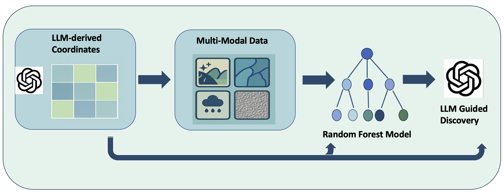

## Ancient Footprints, Modern Pathways to Sustainability
AI-Guided Discovery of Amazonian Dark Earths and Earthworks in the Upper Xingu

The **Upper Xingu** region of Brazil, long inhabited by the **Kuikuro** and other Xinguano groups, holds one of the most intricate pre-Columbian landscapes in Amazonia—marked by ringed settlements, canals, engineered soils (ADE), and forest management systems. While prior studies have illuminated the spatial logic of these "garden cities," much of the region remains **unmapped** and **underexplored**.

This project introduces a **novel AI-assisted pipeline** to identify potential new archaeological sites in the Upper Xingu, focusing on the prediction of **Amazonian Dark Earth (ADE)** zones and **earthworks**. By combining:
- **Synthetic test sites generation**
- **Remote sensing**  
- **Machine learning**  
- **GPT-4.1–based generative reasoning**,  

we build a replicable framework that links Indigenous settlement logic to environmental signatures—enhancing archaeological discovery while honoring cultural context.

---

## Methods Overview
### Synthetic Test Generation: 
We use GPT to select locations based on regional terrain, settlement logic, and environmental patterns drawn from its knowledge base.

### Remote Sensing
We use publicly available environmental data collected via satellite or airborne platforms to extract relevant features:
- **Sentinel-2 imagery** for vegetation indices (NDVI, BSI, NDBI)
- **LiDAR-derived DEM** for elevation and slope
- **WorldClim v2** for climate variables (temperature, precipitation, seasonality)
- **ISRIC SoilGrids** for soil composition (clay %, pH, carbon content)

---

### Training Data
- 2,073 labeled sites from Walker et al. (2022) including ADE, earthwork and others.

### Feature Matrix (32 Total Variables)
- **Soil**: clay %, organic carbon, pH, bulk density, cation exchange capacity  
- **Hydrology**: distance to major/minor rivers, slope-based drainage index  
- **Climate**: 19 bioclimatic variables from 1970–2000  
- **Topography**: LiDAR-derived elevation & slope  
- **Vegetation**: NDVI, NDBI, BSI (from Sentinel-2)  
- **Accessibility**: distance to roads, remoteness index  

---

### Novelty: GPT-Generated Test Site Coordinates ✨

We used **GPT-4** to generate **50 hypothetical site coordinates** in the Upper Xingu, simulating culturally and environmentally plausible locations not included in the training data. This step served two purposes:

1. **Synthetic Test Generation**: GPT selected locations based on regional terrain, settlement logic, and environmental patterns drawn from its knowledge base.
2. **Post-prediction Reasoning**: For top-ranked predictions, GPT performed qualitative reasoning to interpret spatial plausibility based on cultural patterns and terrain resemblance to known sites.

This dual application of GPT represents a **novel method** in archaeological discovery—combining structured prediction with semantic interpretation.

---

## 🔁 Reproducing Our Workflow

This project is organized into **three modular notebooks**, each corresponding to a key stage of our AI-guided archaeological discovery pipeline:

### 🧱 Step 1: Data Collection & Feature Engineering
**Notebook**: `UpperXingu_data.ipynb`  
- Retrieves environmental and geospatial features for both training and GPT-simulated test sites.  
- Outputs a `.csv` with 32 features for ∼2,000 labeled sites and 50 synthetic test sites.

### 🌲 Step 2: Machine Learning Classification
**Notebook**: `Footprint_fullanalysis.ipynb`  
- Trains a Random Forest classifier on labeled ADE/earthwork/other sites.  
- Evaluates feature importance and predicts site classes for the test set.  
- Produces per-site class probabilities and ranked outputs.

### ✨ Step 3: GPT-Guided Interpretation & Site Selection
**Notebook**: `openai_reasoning.ipynb`  
- Uses GPT-4.1 to interpret the classifier output and prioritize candidates.  
- Performs generative reasoning to select the two most promising ADE sites.  
- Outputs a final summary table with coordinates and justification.

---

## 📍 Final Predicted Sites for Field Validation

| Site | Latitude   | Longitude  | ADE Probability |
|------|------------|------------|-----------------|
| 1    | -11.4869   | -55.3030   | 0.458           |
| 2    | -11.3475   | -55.2940   | 0.444           |

These candidate sites are situated on elevated terra firme ridges within 25 km of a major river, in ecologically stable regions—aligning with known ADE settlement patterns.

---

